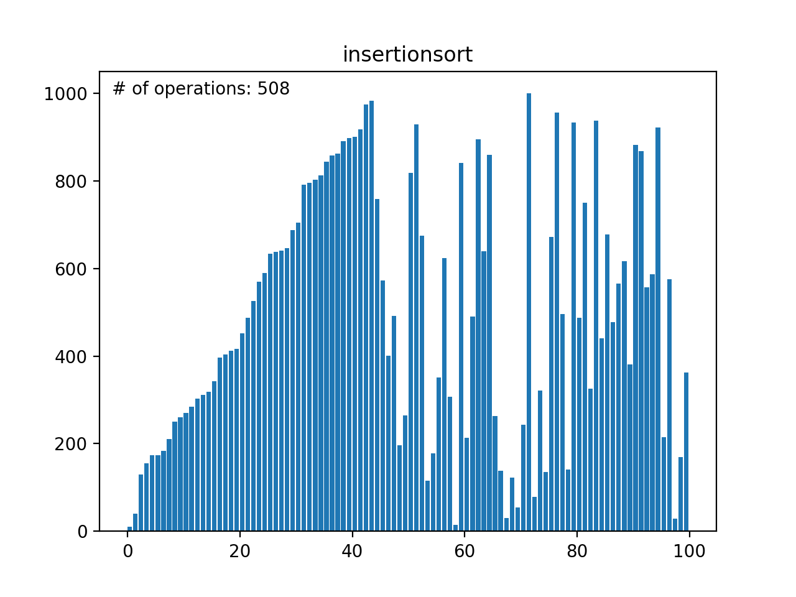
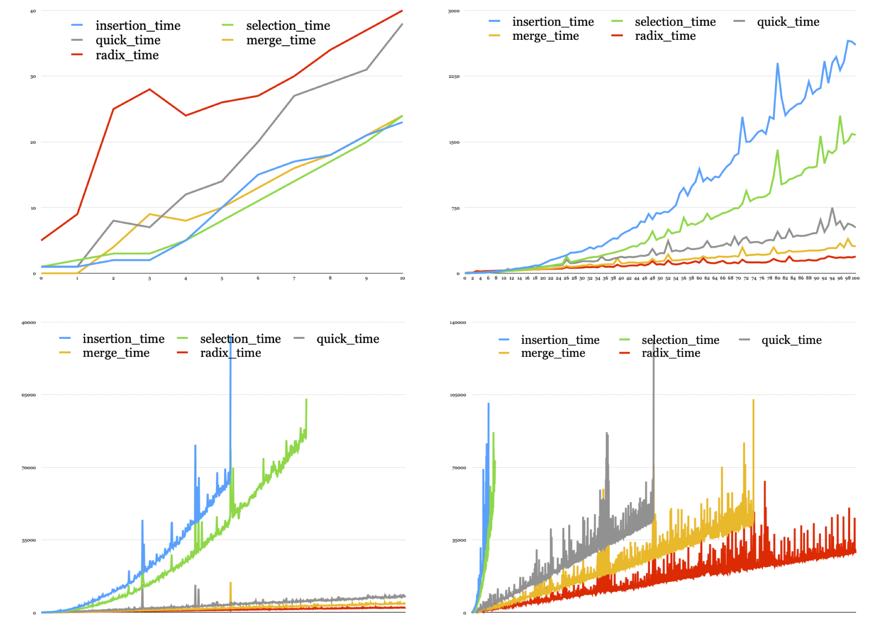
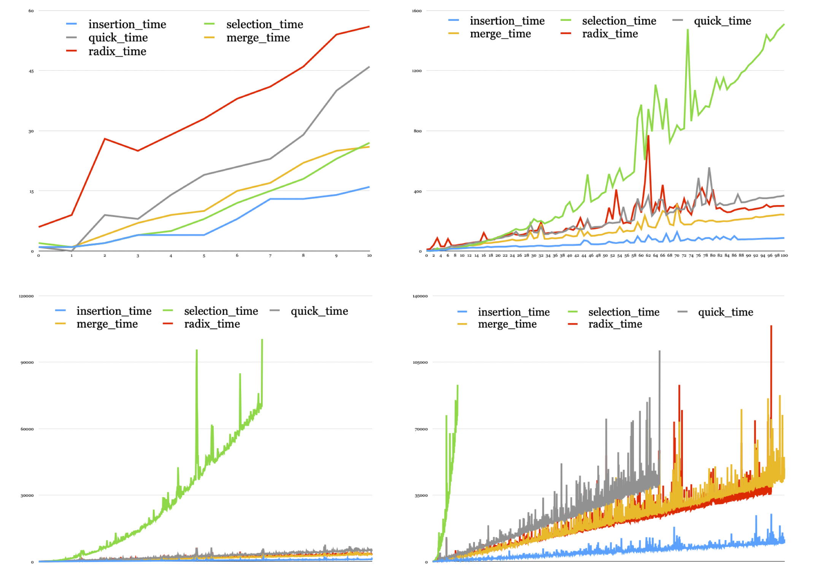

# Sorting-Algorithms

## An implementation and comparison of mergesort, quicksort, radixsort and selectionsort in Python. 

Time used by the algorithms to sort random arrays with different lenghts: 

Time used by the algorithms to sort nearly sorted arrays with different lenghts:

